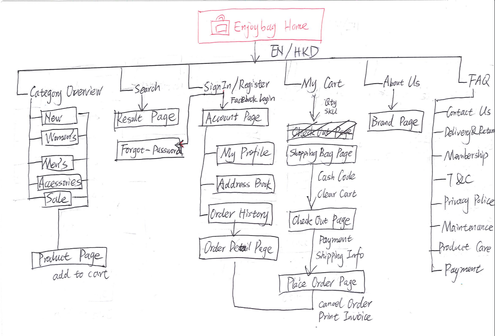

  

  <h3 align="center">Enjoybag Website</h3>

  

    E-commerce website with Angular 7 + JWT + RESTful services 
     
    This project is currently under active development.   
     
    
  

## Table of contents

- [Table of contents](#table-of-contents)
- [What's included](#whats-included)
- [Sitemap](#sitemap)
- [TODO](#todo)
  
## What's included

- [x] Custom Components
- [x] Defining routes including child routes and lazy loaded routes
- [x] Angular reactive form modules 
- [x] Http client and HTTP Interceptors ( JWT and Error )
- [x] Responsive layout
- [x] RxJS/Observables
- [x] Third-party api intergration, like Facebook Login, Paypal
  

## Sitemap
  

## TODO

- Monitor application using Sentry 
- Unit tests with Jasmine and Karma including code coverage.
- End-to-end tests with Protractor
- The SEO problems
